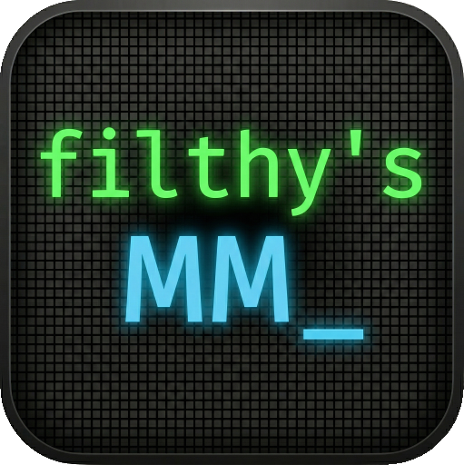

#  filthy's MizMaster

> **"Your personal AI co-pilot for DCS World mission scripting. Whether you're new to coding or a veteran, MizMaster simplifies MOOSE and DML logic, validates syntax, and manages your mission intelligence."**

[](https://filthymanc.github.io/filthys-mizmaster/)
[](https://github.com/filthymanc/filthys-mizmaster/actions)
[](https://github.com/filthymanc/filthys-mizmaster/releases)
[](LICENSE)
[](https://web.dev/progressive-web-apps/)


---

## 🚀 Overview

**filthy's MizMaster** is a cutting-edge Progressive Web Application (PWA) designed as an intelligent "Force Multiplier" for DCS World Mission Designers. By integrating Google's Gemini Pro/Flash models with a specialized **Librarian** engine, MizMaster bridges the gap between complex scripting frameworks and your creative vision.

---

## ✨ Core Features

### 📚 The Librarian Engine

MizMaster doesn't just guess; it researches. The Librarian can browse the entire file trees of the MOOSE and DML frameworks on GitHub, fetching specific class definitions or documentation to provide context-aware scripting solutions.

### 🛡️ Secure Vault Architecture

Your privacy is non-negotiable. MizMaster uses the **Web Crypto API** (AES-GCM 256-bit) to encrypt sensitive credentials (Gemini API Keys, GitHub PATs) locally. Your Master Password is never stored, and your keys are only decrypted in volatile memory during active sessions.

### ⚡ Smart Lua Sanitization

Built-in safety heuristics automatically scan AI-generated code to identify and sanitize potentially "unsafe" DCS Lua environments (like `os`, `io`, or `lfs`), ensuring your scripts are mission-ready and server-safe.

### 📱 Full PWA Support

Install MizMaster directly to your Windows desktop, iPad, or Android tablet. Enjoy offline history access, fast loading via service workers, and a native-app feel without the bloat.

---

## ⌨️ Tactical Navigation (Shortcuts)

Optimized for high-speed mission building:

| Shortcut      | Action                        |
| :------------ | :---------------------------- |
| **Ctrl + ,**  | Open System Settings          |
| **Ctrl + B**  | Toggle Sidebar (Mission List) |
| **Alt + N**   | Create New Mission            |
| **Alt + ←/→** | Cycle Previous/Next Mission   |
| **/**         | Focus Chat Input              |
| **Esc**       | Stop Generation / Close Menus |

---

## 🛠️ Getting Started

### 1. Launch the Application

Access the production version immediately at:
👉 **[https://filthymanc.github.io/filthys-mizmaster/](https://filthymanc.github.io/filthys-mizmaster/)**

### 2. Configure Your Co-Pilot

1.  **Get a Gemini API Key:** Obtain a free key from the [Google AI Studio](https://aistudio.google.com/app/apikey).
2.  **Initialize the Vault:** When you first launch MizMaster, you'll be asked to create a **Master Password**. This password is the only way to unlock your encrypted keys.
3.  **Connect the Librarian (Optional):** Add a GitHub Personal Access Token in the **Data & Identity** settings to increase the Librarian's rate limits for deep repository searches.

---

## 🤝 Join the Community

Connect with other mission designers, share your scripts, and get direct support:
🎮 **[Official Discord Server](https://discord.gg/VsYRpDT5CW)**

---

## 💻 Developer Guide

### Tech Stack

- **Framework:** React 19 (TypeScript)
- **Build Tool:** Vite 5
- **Styling:** Tailwind CSS
- **Intelligence:** Google GenAI SDK (`gemini-3.1-pro-preview` / `gemini-3-flash-preview`)
- **Storage:** IndexedDB (for mission history) & LocalStorage (for encrypted vault)

### Local Setup

1.  **Clone the Repository:**
    ```bash
    git clone https://github.com/filthymanc/filthys-mizmaster.git
    cd filthys-mizmaster
    ```
2.  **Install Dependencies:**
    ```bash
    npm install
    ```
3.  **Run Development Server:**
    ```bash
    npm run dev
    ```
4.  **Build Production Bundle:**
    ```bash
    npm run build
    ```

---

## ⚖️ Legal & Compliance

### License

This project is licensed under the **GNU General Public License v3.0**. See the [LICENSE](LICENSE) file for details.

### Trademark & Attribution

- **filthy's MizMaster** is a trademark of "the filthymanc". Per GPL v3 Section 7(e), forks intended for public distribution **must** be renamed to avoid trademark confusion.
- **DCS World** is a trademark of Eagle Dynamics SA.
- **MOOSE** is the intellectual property of FlightControl-Master.
- **DML** is the intellectual property of csofranz.

MizMaster is a community tool and is not officially affiliated with or endorsed by Eagle Dynamics, the MOOSE team, or the DML team.

---

<p align="center">
  Developed with ❤️ by <b>the filthymanc</b> for the DCS World Community.
</p>
